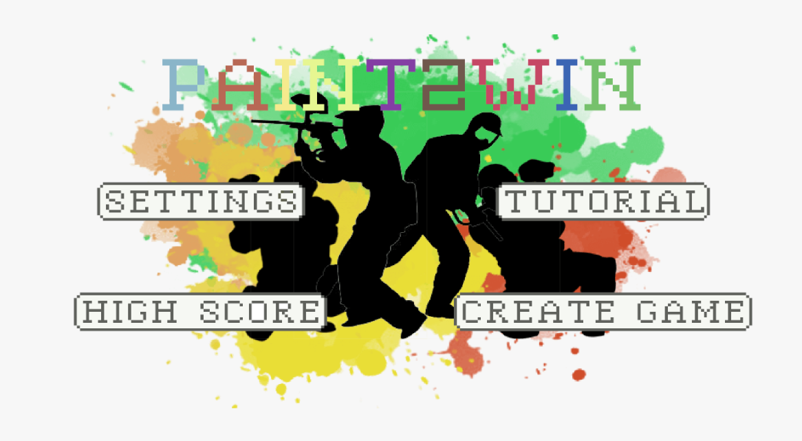

# Paint2Win

Paint2Win is a competitive singleplayer top-down shooter game. The objective of the game is to shoot 20 targets in the shortest amount of time. After each play the score is added to a highscore-list so that you can compete against others. To make the game even more interesting we have added two different maps that you can choose between. In addition the targets are randomly generated, so to become the best you will need a combination of both skills and luck!

## How to play
 

When starting the game the first screen that pops up is the Main Menu. From the Main Menu you can enter 4 different pages.
- On the settings page it is possible to adjust the sound and sfx volume
- The highscore page displays the top 10 scores achieved by all players for both maps
- The tutorial page explains how the game is played
- The create game page lets the user create a new game. When creating the game the player must choose a name, a map and a color

 <br>
The goal of the game is to shoot the target, which is the red and white circle. In the top left corner the current number of targets hit and the number of targets needed to be hit is shown. In the top right corner the time used so far is displayed. 
To move the player around the joystick in the bottom left corner is used. For shooting direction and for firing bullets the joystick in the bottom right corner is used. The player will continously shoot bullets when the shooting joystick is in use. 

## Run project

```
1. $ git clone git@gitlab.stud.idi.ntnu.no:tdt4240-group-15/group-15.git
2. Open the project in Android Studios
3. From the target device drop-down menu, select the device that you want to run your app on
4. Click **Run** (The green triangle)
```
- If the backend is not running follow the steps below for starting up the backend. 
- For TDT4240 Course Staff: The backend will be running until the end of the 2021 spring semester.


## Running the backend

This is for developement purposes only. The production backend is already running.

#### Prerequisites:
- Gradle 6.7.1
- Docker Compose OR MySQL server 8.0
- Java 8+
### Running the database
You can either connect to the production database on a Digital Ocean, run a MySQL server pre-configured on Docker, or host your own MySQL-server.
##### Docker
From the project root, run docker compose up. This will start a docker container on your local machine, hosting a pre-configured MySQL-server.
#### MySQL-server
Connect to your MySQL-server, and create a database named `paint2win`. To create compatible users and tables, run the scripts found in `./Dockerfiles/schema.sql`.
### Specifying the database
Before compiling the Java REST API server, you need to specify which database to use.
In the file ./REST/assets/application.properties, set the attribute `spring.datasource.url` to match the location of the database you wish to connect to. In general, this will be `jdbc:mysql://localhost:3306/paint2win` in developement (local Docker or MySQL), and `jdbc:mysql://46.101.118.152:3306/paint2win` in production.
Compiling/packing and running the REST API:
From the project root, run "gradle rest:bootJar". This will compile a JAR with all the dependencies to `./REST/build/libs`.
This file can then be run from the command line with `java -jar ./REST/build/libs/FILENAME.jar`.
Alternatively, you can run the server directly from Android Studios by running the Main Class `RESTApiServer.java` file.
After following these steps, you should have a REST API server listening on http://localhost:8080.
Alternatively, the production server is running at http://46.101.118.152:8080.


## Structure
Below is a overview of the most important files included in the project structure:

**/root**: The root of the project. It contains Android, Core, Desktop, REST and Gradle Scripts. Android are specific code for making the application run on differnt android platforms. Core is containing the logic and implemenation of the game while REST is the server. 

- **/android** 
    - **/assets**: Containing the images, mp3-files and styling files used 
    - **/java/src/com/tdt4240/paint2Win**: Contains AndroidLauncher which launches the app on the android device 
- **/core**
    - **/java/src/com/tdt4240/paint2Win**
        - **/container**: The different containers used to fulfil object pool
        - **/controller**: Handling user input
            - **/controls**: Containing the logic for player movement
            - **/managers**: Contains logic for audiohandling, collision and respawning
            - **/states**: All the different screens
        - **/model**: Containing much of the data objects
            - **/maps**: The different maps to choose from are created here
        - **/networking**: The logic for communication with the server
            - **/Dto**: Creates the dataobjects to be sent and received
        - **/utility**: Helper classes
        - **/view**: Contains the different renderClasses
- **/desktop**
    - **/java/src/com/tdt4240/paint2Win**: Contains DesktopLauncher which is used to lanch the app without a android device
- **/REST**
    - **/java/src/com/tdt4240/paint2Win/rest**:
        - **/controller**: Classes that defines the REST API endpoints
        - **/model**: Type/structure definitions of the objects handled by the API
        - **/repository**: Interface that defines the API for getting and posting objects defined in model to and from the database.
        - **/service**: Classes that use a repository to perform specific requests on the database for a given model
        - **/utils**: Utility classes, currently only contains the MapName Enum.
        readme_assets
- **/readme_assets**: Containing the pictures used in the README
- **/Dockerfiles**: Used to build a Docker container with a MySQL-database
- **/Gradle Scripts**: Gradle specific files

## Tech Stack
 

